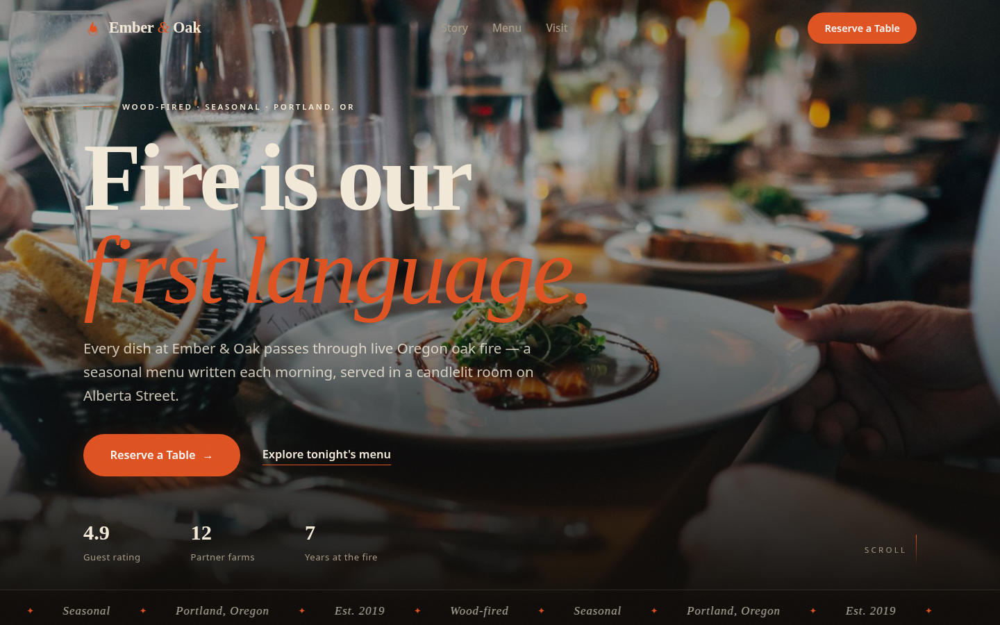

> **Live demo:** [https://ember-oak-restaurant-website.vercel.app](https://ember-oak-restaurant-website.vercel.app)



---

# Ember & Oak Kitchen — Restaurant Landing Page

A complete, mobile-friendly landing page for **Ember & Oak Kitchen**, a fictional upscale-casual wood-fired restaurant in Portland, Oregon. Built as a demo portfolio piece showing what a real small business website can look like.

## What it is

A single-page marketing site rebuilt from scratch to an award-winning design standard, designed to turn visitors into reservations. It includes:

- **Sticky navigation** with a full-screen overlay mobile menu
- **Cinematic hero** — real food photography with a slow Ken Burns zoom, staggered line-mask headline reveal ("Fire is our *first language.*"), dual CTA hierarchy (primary "Reserve a Table" + quiet "Explore tonight's menu"), animated stat counters, and a marquee strip
- **Our Story** — editorial asymmetric layout with drop cap and chef photography
- **Menu highlights** — fine-dining dotted-leader menu with tabbed categories and crossfading dish photography
- **Hours & location** with hours table, transit info, and a "Find the glow" card
- **Online reservation form** with full client-side validation (name, email, phone, party size, date ≥ today, time) and an animated success confirmation state
- **Responsive design** — fluid `clamp()` typography, mobile-first; verified at 390px and 1440px
- Scroll-reveal animations, one shared easing curve, and reduced-motion support for accessibility
- **SEO**: semantic HTML, meta/OG tags, and JSON-LD Restaurant structured data

## Tech used

- Plain HTML5, CSS3, and vanilla JavaScript — no build step, no framework
- Google Fonts (Fraunces + Inter) via CDN with `display=swap`
- Real photography bundled locally in `assets/` (no hotlinking, so the page never breaks)
- Design system: `--bg` / `--surface` / `--ink` / `--muted` / `--accent` (warm charcoal, cream, single ember-orange accent)

## The business problem it solves

Restaurants lose bookings when customers can't reserve online — most people check a restaurant's website on their phone and will pick a competitor rather than call during business hours. This page fixes that: it presents the menu and story beautifully on any device and captures reservations directly with a validated form, so the restaurant stops losing walk-in-to-online customers and the owner never pays a third-party booking platform a cut.

## Run / view

No build or server needed — open the file directly in any browser:

```
open ./index.html
```

Or serve it locally with:

```
cd ~/workspace/upwork-portfolio/01-restaurant-landing && python3 -m http.server 8000
```

then visit http://localhost:8000.
